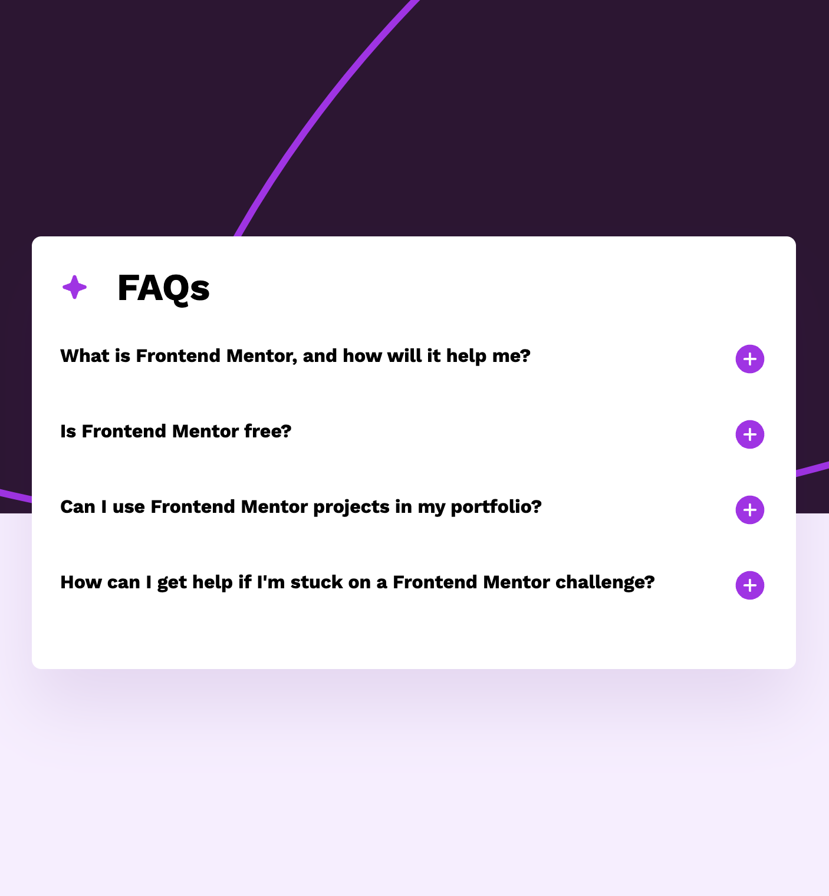

# Frontend Mentor - FAQ accordion solution

This is a solution to the [FAQ accordion challenge on Frontend Mentor](https://www.frontendmentor.io/challenges/faq-accordion-wyfFdeBwBz). Frontend Mentor challenges help you improve your coding skills by building realistic projects. 

My challenge for this project was to build out this faq accordion component and get it looking as close to the design as possible in only 30 minutes. 

I was able to complete the component in vanilla HTML and CSS in just 44 minutes. Pretty close! In that time, I made sure the component was fully responsive and  accessible to keyboard users, including on-brand colors for the keyboard focus ring, etc.

I took another 5 minutes to create this readme and deploy the site to Netlify.

**Note: Delete this note and update the table of contents based on what sections you keep.**

## Overview

### The challenge

Users should be able to:

- Hide/Show the answer to a question when the question is clicked
- Navigate the questions and hide/show answers using keyboard navigation alone
- View the optimal layout for the interface depending on their device's screen size
- See hover and focus states for all interactive elements on the page

### Screenshot

### Links

- Solution URL: [Github Repo](https://github.com/joekotvas/faq-accordion)
- Live Site URL: [FAQ Accordion Component](https://faq-accordion-joekotvas.netlify.com)

## Built with

- Semantic HTML5 markup
- CSS custom properties
- Flexbox

## Author

- Website - [Joseph Kotvas](https://www.jokma.com)
- Frontend Mentor - [@joekotvas](https://www.frontendmentor.io/profile/joekotvas)